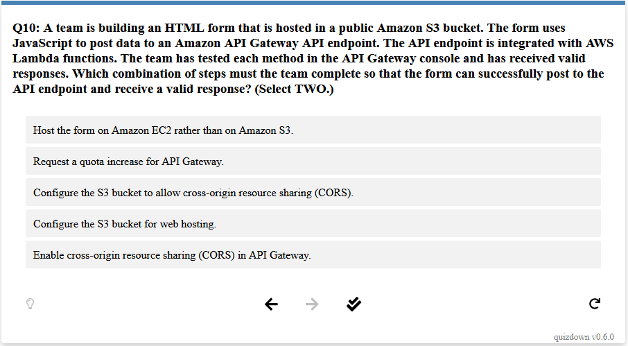

## Quizplosion 💣💥

Turns [quizdown](https://github.com/bonartm/quizdown-js)-formatted markdown files into quizzes.

> 💡 **Tip:** Try the [online editor](https://bonartm.github.io/quizdown-live-editor) if you never used quizdown


### Instructions

Install dependencies

```bash
pip install -r requirements.txt
```

Ask for help 🙋‍♂️

```bash
python main.py --help
```

Generate a quiz

```bash
python main.py examples/sap_c02_practice_exam.md
```

Generate a quiz from a custom template

```bash
python main.py --template quiz.html.j2 \
               --variables '{"n_questions": 5, "shuffle_questions": true}' \
               --output examples/sap_c02_practice_exam.html \
               examples/sap_c02_practice_exam.md
```

